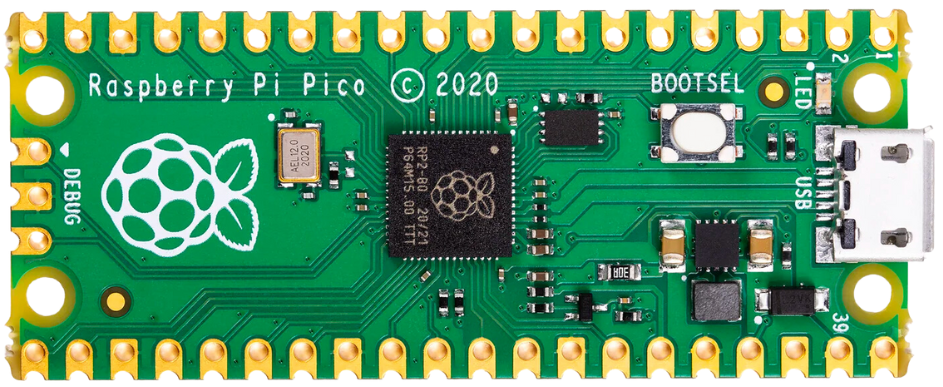
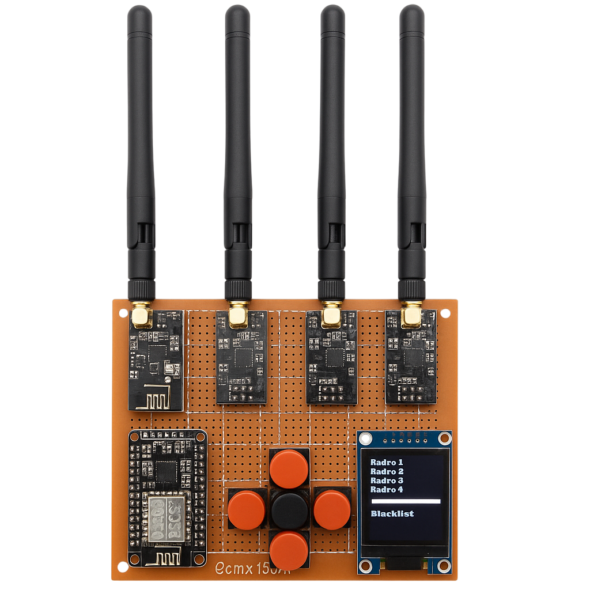

# 👾 Bienvenido a Cybersen
---
## Acerca de Cybersen
Cybersen es un grupo académico dedicado a la formación, desarrollo y promoción de la ciberseguridad y el hacking ético 👾  
Nuestra misión es promover el conocimiento, desarrollar habilidades e inspirar creatividad en la frontera digital a través de proyectos innovadores y visionarios.
---

## 🔗 Únete a la Comunidad
¡Sumérgete en el mundo de la ciberseguridad con nosotros!  
Explora nuestro [Repositorio Cybersen](https://github.com/cybersengroup), contribuye a iniciativas de código abierto y colabora en herramientas de vanguardia.  
Ya seas principiante o hacker experimentado, Cybersen es tu espacio para crecer e innovar.
---
## 📡 Contáctanos
¡Conectemos y construyamos el futuro de la ciberseguridad juntos!
- 📧 Email: [cybersengroup@gmail.com](mailto:cybersengroup@gmail.com)  
- 🐦 X (Twitter): [@cybersengroup](https://x.com/cybersengroup)  
- 💼 LinkedIn: [Cybersen Group](https://www.linkedin.com/in/cybersen-group-904682349/)  
- 📸 Instagram: [@cybersengroup](https://www.instagram.com/cybersengroup/)  
- 📹 YouTube: [Cybersen](https://www.youtube.com/@CybersenGroup)  
- 💬 Discord: [Únete](https://discord.gg/CTq7js2mtu)  
- 🌐 GitHub: [cybersengroup](https://github.com/cybersengroup)  
- 📘 Facebook: [CyberSenGroup](https://www.facebook.com/CyberSenGroup)  

## 🔜 Próximamente
### 🔧 Keros  
**Tu puerta de entrada de bolsillo al hacking de hardware**  
Un dispositivo compacto basado en ESP32 diseñado para pruebas de penetración caseras e investigación de seguridad IoT. Lo suficientemente pequeño para caber en tu bolsillo, lo suficientemente potente para desbloquear nuevas posibilidades.  

### 🦆 PicoDucky  
**El USB sigiloso que contraataca**  
Nuestro Rubber Ducky casero construido con tecnología Raspberry Pi. Perfecto para pruebas de seguridad y demostrar las vulnerabilidades de sistemas desatendidos.  

### 📡 Bluetooth Jammer  
**Interrumpiendo conexiones para investigación de seguridad**  
Una herramienta especializada para probar implementaciones de seguridad Bluetooth y entender las vulnerabilidades de comunicación inalámbrica en entornos controlados.  

### 🕸️ Portal Cautivo con ESP32  
**Ingeniería social simplificada**  
Un sistema de portal cautivo alimentado por ESP32 para demostraciones educativas de técnicas de phishing y entrenamiento de conciencia del usuario.  

