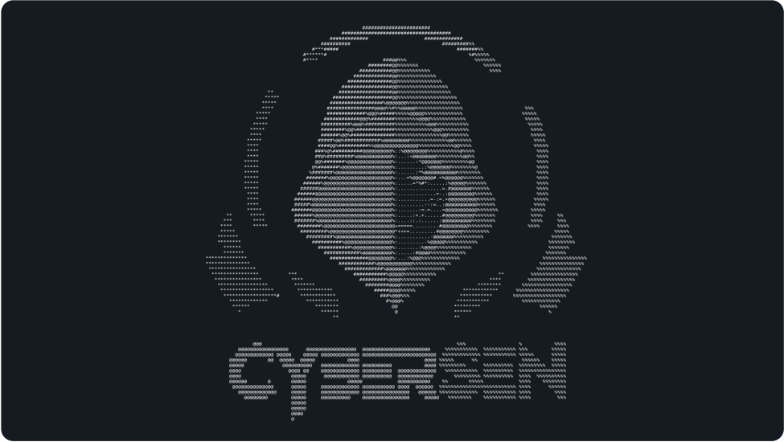

# 👾 Welcome to Cybersen

---

## About Cybersen

**Cybersen** is an **academic group dedicated to the training, development, and promotion of cybersecurity and ethical hacking** 👾

Blending cyberpunk aesthetics with high-tech solutions, Cybersen empowers a growing community of students, geeks, and visionaries.  
Our mission is to promote knowledge, develop skills, and inspire creativity in the digital frontier through innovative, forward-thinking projects.

---

## 🔗 Join the Community

Dive into the world of cybersecurity with us!  
Explore our [Cybersen Repository](https://github.com/cybersengroup), contribute to open-source initiatives, and collaborate on cutting-edge tools.  
Whether you're a beginner or an experienced hacker, Cybersen is your space to grow and innovate.

---

## 📡 Contact Us

Let’s connect and build the future of cybersecurity together!

- 📧 **Email**: [cybersengroup@gmail.com](mailto:cybersengroup@gmail.com)  
- 🐦 **X (Twitter)**: [@cybersengroup](https://x.com/cybersengroup)  
- 💼 **LinkedIn**: [Cybersen Group](https://www.linkedin.com/in/cybersen-group-904682349/)  
- 📸 **Instagram**: [@cybersengroup](https://www.instagram.com/cybersengroup/)  
- 📹 **YouTube**: [Cybersen](https://www.youtube.com/@CybersenGroup)  
- 💬 **Discord**: [Join](https://discord.gg/CTq7js2mtu)  
- 🌐 **GitHub**: [cybersengroup](https://github.com/cybersengroup)  
- 📘 **Facebook**: [CyberSenGroup](https://www.facebook.com/CyberSenGroup)  
